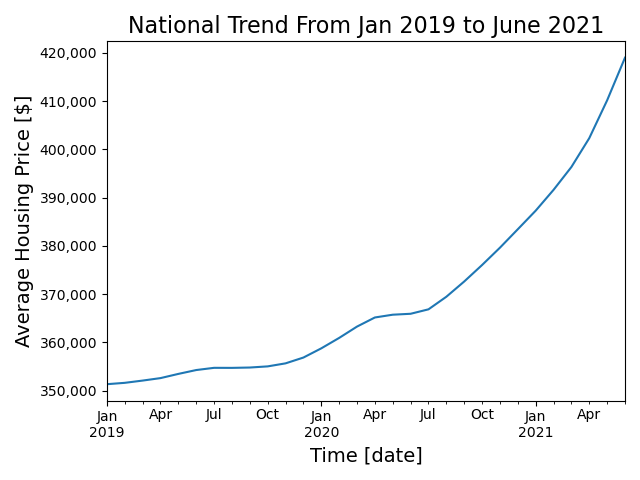

# Data Incubator Code Challenge Section 1
# Covid Impact on US Housing Market

##Part 1: Motivation

Covid 19 is the most important incident happened in 2020, and continuously affects every
body's daily life. Based on wikipedia [1] and other sources, there have been 34 million confirmed cases and 608K death in the 
United States only. 

Since beginning of 2020 when Covid19 started, every aspect of daily life has been changed, such as physcial and mental health,
social justice and inequality, racial discrimination, as well as economy and financial activities.
The most prominent effect of Covid 19 on economy is great amount of QE, and as a result, large variation in the stock market. My interest lies in how Covid 19 affect common people's life 
financially. 

To answer this question, I chose housing buying activities as one case of all kinds of financial activities for following reasons:
(1) housing market is directly close to every body's life; (2) it has large local impact as well as national trend; (3) baseline can be easily established by pre-pandemic housing market; (4) many other factors make a contribution, such as policy making
and people's preference, which help us to understand contributions from other factors. Therefore,
I would like to investigate how the housing market is affected by Covid 19. 

##Part 2: Data Source
Housing Market Data is acquired from Zillow [2], and Covid 19 data in 
the US is obtained on USfacts.org [3]. Both data are readly download from the website. The downloaded format is CSV file, where Zillow data is around 72 MB, and Covid data is around 11 MB.

##Part 3: Data Clean and Preprocessing
### Data Source 1: Zillow
For better integration with other data sources, here only county information is used for geographic information. Readers may also use other geographic information such as Zip code, City for analysis.
In order to investigate Covid 19 impact on the houring market, the time range is limited from Jan 2019 to June 2021, the latest date which the data is available.

##Part 4: Method
This project used Pandas as main libary to analyze the data and generate plots.

##Part 5: Result
Figure 1. National Trend from Jan 2019 to June 2021

##Ref
[1] https://en.wikipedia.org/wiki/Template:COVID-19_pandemic_data
[2] https://www.zillow.com/research/data/
[3] https://usafacts.org/visualizations/coronavirus-covid-19-spread-map/