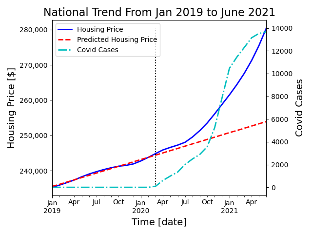

# Covid Impact on US Housing Market

## Part 1: Motivation

Covid 19 is the most important incident happened in 2020, and continuously affects every
body's daily life. Based on wikipedia [1] and other sources, there have been 34 million confirmed cases and 608K death in the 
United States only. 

Since beginning of 2020 when Covid 19 started, every aspect of daily life has been changed, such as physical and mental health,
social justice and inequality, racial discrimination, as well as economy.
The most prominent effect of Covid 19 on economy is great amount of QE, and low interest rates. My interest lies in how Covid 19 affects common people's life 
financially. 

To answer this question, I chose the housing market as one specific market to shed lights on Covid 19 impacts for following reasons:
(1) the housing market is directly close to every body's life; (2) it has both local impact as well as national trend; (3) baseline can be easily established by the pre-pandemic housing market; (4) it's also impacted by other factors, such as interest rate
and people's preference. Therefore, I would like to investigate how the housing market is affected by Covid 19. 

## Part 2: Data Source
Housing Market Data is acquired from Zillow [2], and Covid 19 data in 
the US is obtained on USfacts.org [3]. Both data are readily download from the website. The downloaded format is CSV file, where Zillow data is around 72 MB, and Covid data is around 11 MB.

## Part 3: Data Clean and Preprocessing
### Data Source 1: Zillow
For better integration with other data sources, here only state level information is used. Smaller granularity can be achieved using lower level geographic information such as Zip code, City, and County.
Covid 19 impact is very time sensitive, so the time range is limited from Jan 2019 to June 2021, the latest date which the data is available.
### Data Source 2: Covid
Similar as the housing market, Covid data is also limited to state level data, and the time range is from the earliest date to June 2021.

### Data Source 3: Political Status
In terms of political status for each state, I used 2020 election result [4] to represent political status of each state, assuming the latest election result represents the latest political preference for each state. 
If the final election result is Mr. Trump for that state, it is marked as "Replublican", and vise versa. 

## Part 4: Method
This project used Pandas as the main library to analyze the data and generate plots. The predicted housing market value is generated from the time range Jan 
2019 to March 2020 with linear regression from sklearn library. 

For the segmentation of state level data in graph 2, surport vector machine is used to fit the model with housing value and covid cases as features X, and political status as results Y.

## Part 5: Result
Figure 1. National Trend from Jan 2019 to June 2021

As you can see in the Figure 1, national trend of the housing market shows overall increasing trend with sigificant impact 
from Covid 19. From Jan 2019 to March 2020, the average housing price mildly increases and follows linear regression very well, without any impact from Covid 19. Then as Covid cases increase in March 2020,
upto July 2020, the price shows slightly lower growth rate. What's interesting is after July 2020, when the Covid 19 cases skyrocket, the average price also increases significantly. 

Figure 2. Average Housing Value VS Accumulated Covid Cases For Each Sate By June 2021 

If we dig the data deeper into the state level, we will see more interesting result. Here what I plot is average housing value in each state vs accumulated cases in each state by June 2021. I also labeled 
each state with its 2020 election result to indicate its political status. First of all, the data points are positioned around upper left part of the graph, indicating the more Covid cases, the higher housing value. But there is no clear trendline between these two, and they are much scattered around.
However, there seems a ditinction between Republican states and Demoncratic states. Republican states are more in the lower left corner with smaller number of Covid cases and lower housing value, whereas Demoncratic states are more likely to have more Covid Cases and higher housing value.
To segment Republican and Demoncratic states, I used a simple SVM model with linear kernel. The black line shows the decision surface based on housing value and covid cases. You can see the model segments the data points quite well. 

## Part 6: Conclusion
From this preliminary analysis, we can clearly see the impact of Covid 19 on the housing market, and possibly a political status dependence. 
Due to time limitation, I only get chance to analyze the data at national and state level, but further analysis can be done with these data sets down to county level and even for each zip code for better data visualization.
If time allows, more factors will be analyzed such as general sentiment from Tweeter, stock market, supply chain and demographic information.  As more Covid show up due to Delta variants, the past
data analysis may shed light on future housing market.

## Ref
[1] https://en.wikipedia.org/wiki/COVID-19_pandemic 
[2] Housing related data from Zillow: https://www.zillow.com/research/data/ 
[3] Covid related data: https://usafacts.org/visualizations/coronavirus-covid-19-spread-map/ 
[4] Election Result in 2020: https://en.wikipedia.org/wiki/Red_states_and_blue_states 