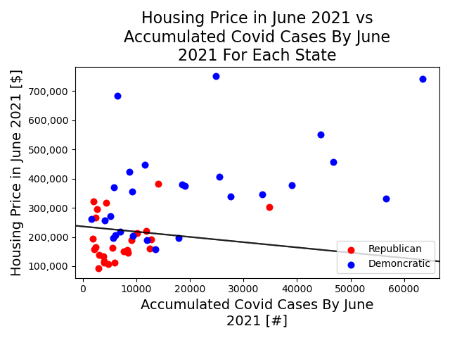

# Covid Impact on US Housing Market

##Part 1: Motivation

Covid 19 is the most important incident happened in 2020, and continuously affects every
body's daily life. Based on wikipedia [1] and other sources, there have been 34 million confirmed cases and 608K death in the 
United States only. 

Since beginning of 2020 when Covid19 started, every aspect of daily life has been changed, such as physcial and mental health,
social justice and inequality, racial discrimination, as well as economy and financial activities.
The most prominent effect of Covid 19 on economy is great amount of QE, and as a result, large variation in the stock market. My interest lies in how Covid 19 affects common people's life 
financially. 

To answer this question, I chose housing buying activities as one case of all kinds of financial activities for following reasons:
(1) housing market is directly close to every body's life; (2) it has large local impact as well as national trend; (3) baseline can be easily established by pre-pandemic housing market; (4) many other factors make a contribution, such as policy making
and people's preference, which help us to understand contributions from other factors. Therefore,
I would like to investigate how the housing market is affected by Covid 19. 

##Part 2: Data Source
Housing Market Data is acquired from Zillow [2], and Covid 19 data in 
the US is obtained on USfacts.org [3]. Both data are readily download from the website. The downloaded format is CSV file, where Zillow data is around 72 MB, and Covid data is around 11 MB.

##Part 3: Data Clean and Preprocessing
### Data Source 1: Zillow
For better integration with other data sources, here only county information is used for geographic information. Readers may also use other geographic information such as Zip code, City for analysis.
In order to investigate Covid 19 impact on the housing market, the time range is limited from Jan 2019 to June 2021, the latest date which the data is available.
### Data Source 2: Others
Due to time limitation, other data is not analyzed. If time allowed, Covid 19 data will be analyzed and integrate with the housing data.

##Part 4: Method
This project used Pandas as the main library to analyze the data and generate plots. The predicted housing market value is generated from the time range Jan 
2019 to March 2020 with linear regression from sklearn library.

##Part 5: Result
Figure 1. National Trend from Jan 2019 to June 2021

As you can see in the Figure 1, national trend of the housing market shows very interesting trend. Overall, it increases with time but the rate
varies significantly and show significant correlation with Covid 19. From Jan 2019 to March 2020, the average price mildly increases and follows linear regression very well, and no impact from Covid 19. Then as Covid cases increase in March 2020,
upto July 2020, it shows slightly lower growth rate. What's more interesting, after July 2020, when the Covid 19 cases skyrocket, the average price also increases significantly. 

Figure 2. Difference Between Average Housing Price and Predicted Price

It is even more obvious if we plot the difference between the average price with the predicted value from linear regression model, as shown in Figure 2.
The difference is close to zero till Jan 2020. Then it slightly increases upto March 2020. With Stay-at-Home order in March, the difference stays the same till July, 2020. Then it increases significantly.

##Part 6: Conclusion
From this preliminary analysis, we can clearly see the correlation between Covid 19 and the housing market. Due to time limitation, I only get chance to analyze the national trend, but further analysis can be done with these data sets.

##Ref
[1] https://en.wikipedia.org/wiki/Template:COVID-19_pandemic_data
[2] Housing related data from Zillow: https://www.zillow.com/research/data/
[3] Covid related data: https://usafacts.org/visualizations/coronavirus-covid-19-spread-map/
[4] Federal Fund rate data: https://fred.stlouisfed.org/series/FEDFUNDS